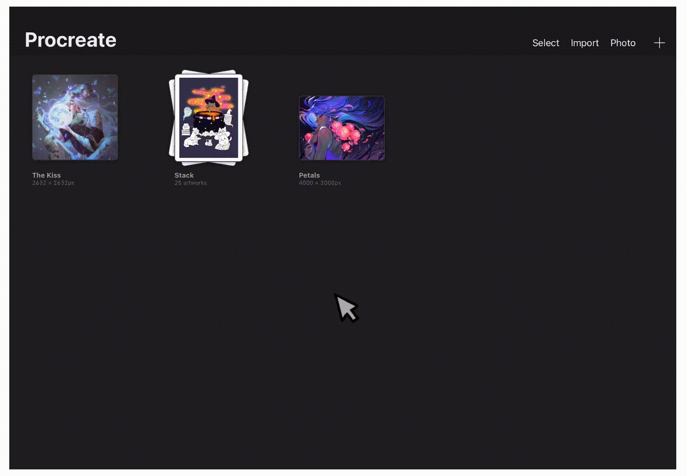

[Home](index.md) | [Manual Assessment Memo](manual_assessment_memo.md) | [Chatbot](chatbot.md) | [Procedure Video](procedure_video.md) | [Manual](manual.md) | [My Blog](reflective_blogs.md) 

# Procreate User Manual 
# Table of Contents

- [Getting Started](#getting-started)
    - [Tools](#tools)
- Understanding the Gallery
    - Create
      - Default Canvas Templates
      - Edit a Template
      - Delete a Template
      - Create a Custom Canvas
    - Preview
    - Photo
    - Import
    - Organization
- Understanding the Workspace
- Brushes & Tools
- Layers & Masks
- Colors & Palettes 
- Transform & Adjustments
- Selection & Actions
- Animation & Time Lapse
- Exporting & Sharing Artwork

Welcome to your comprehensive guide for mastering digital art on Procreate for iPad.

Procreate is a powerful tool that provides studio-quality resources at your fingertips, all for a one-time purchase. Whether you are new to digital drawing or new to Procreate itself, this manual offers step-by-step instructions and explanations for the wide array of tools that Procreate offers.

# Getting Started
## Tools
- iPad (Procreate is an iPad exclusive)
- Apple Pencil (recommended, works like a normal pencil and makes drawing more comfortable)
Purchase and download Procreate from the App Store on your iPad. 

# Understanding the Gallery
The Gallery is the main page of Procreate. Here, you can create new projects, preview existing projects, import photos and files, and organize your projects. The following will explain how to utilize the Gallery.

## Create
Tap the '+' icon at the top of the Gallery to create a new canvas.

### Default Canvas Templates
In the New canvas menu, procreate offers a variety of default canvas templates to choose from depending on your needs. Below is an image of the default canvases available.

### Edit a Template
Procreate offers the ability to edit existing templates

1. Swipe left on an existing template to reveal the options menu.
2. Tap 'Edit' to view the Custom Canvas options.

a) Canvas Name - Tap to change the name of the canvas.

b) Dimensions - Here you can change the width, height, and DPI of the canvas. (Note: the higher the resolution, the lower the maximum layers allowed)

c) Color profile - Your project's colors will look different on different screens and media. Here, you can change the color profile to best fit your needs.

d) Time-lapse settings - These are the settings for the exported time-lapse of this project. Here, you can change the resolution, compression, and file type.

e) Canvas Properties - Here, you can edit the default background color of the canvas or hide the background.

3. Click 'Save' at the top right to save your changes.
