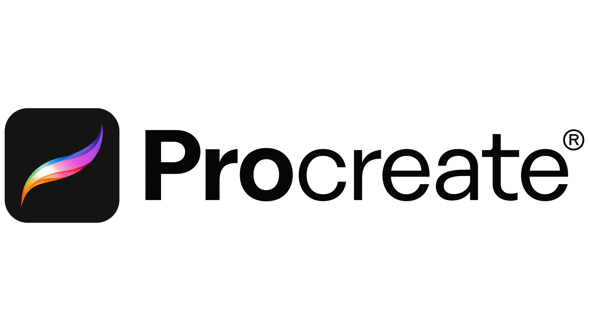
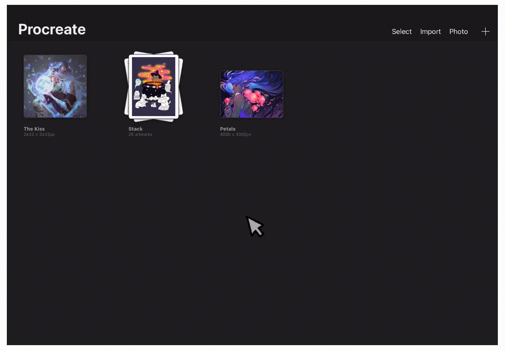
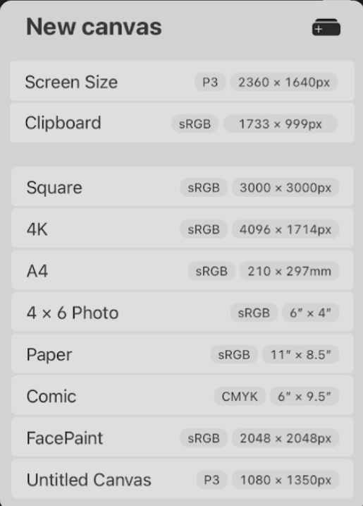
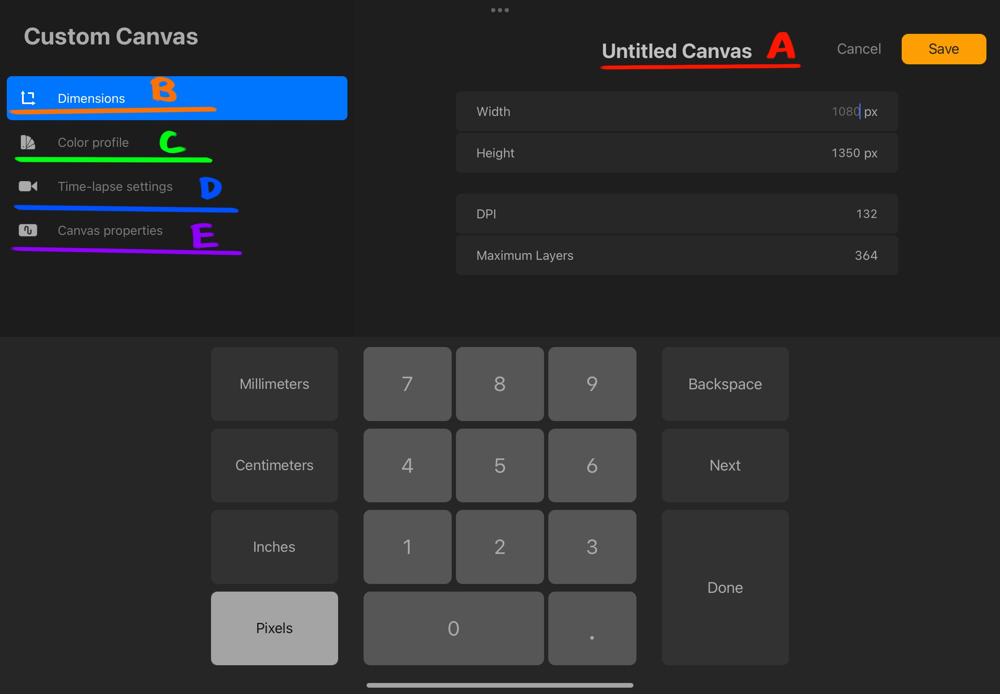
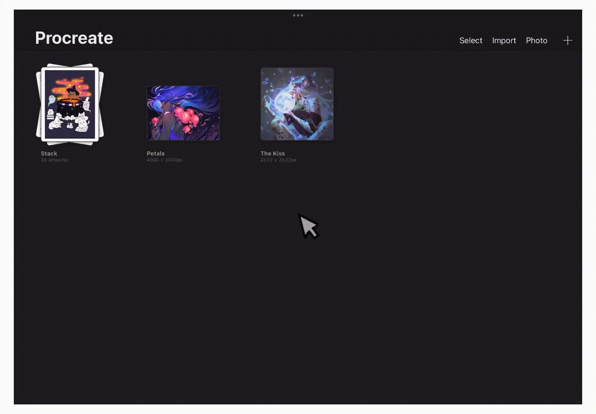
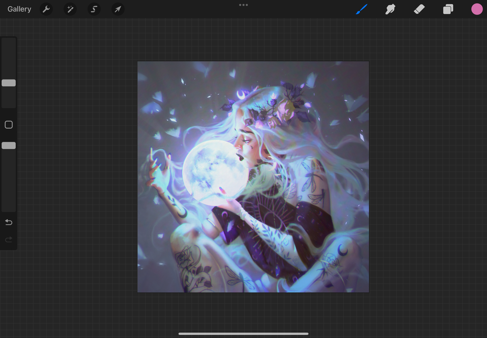
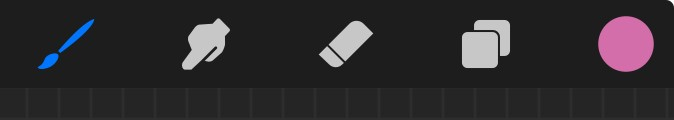
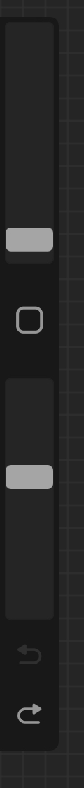
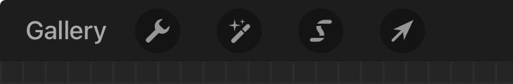

[Home](index.md) | [Manual Assessment Memo](manual_assessment_memo.md) | [Chatbot](chatbot.md) | [Procedure Video](procedure_video.md) | [Manual](manual.md) | [My Blog](reflective_blogs.md) 

# Procreate User Manual 
# Table of Contents

- [Getting Started](#getting-started)
    - [Tools](#tools)
- [Understanding the Gallery](#understanding-the-gallery)
    - [Create a Canvas](#create-a-canvas)
    - [Default Canvas Templates](#default-canvas-templates)
    - [Edit or Delete Templates](#edit-or-delete-templates)
    - [Create a Custom Canvas](#create-a-custom-canvas)
    - [Preview](#preview)
    - [Photo](#photo)
    - [Import](#import)
    - [Organization](#organization)
- [Understanding the Workspace](#understanding-the-workspace)
    - [Painting Tools](#painting-tools)
    - [Side Bar](#sidebar)
    - [Editing Tools](#editing-tools)
- Brushes & Tools
- Layers & Masks
- Colors & Palettes 
- Transform & Adjustments
- Selection & Actions
- Exporting & Sharing Artwork

Welcome to your comprehensive guide for mastering digital art on Procreate for iPad.

Procreate is a powerful tool that provides studio-quality resources at your fingertips, all for a one-time purchase. Whether you are new to digital drawing or new to Procreate itself, this manual offers step-by-step instructions and explanations for the wide array of tools that Procreate offers.

# Getting Started
## Tools
- iPad (Procreate is an iPad exclusive)
- Apple Pencil (recommended, works like a normal pencil and makes drawing more comfortable)
Purchase and download Procreate from the App Store on your iPad. 

# Understanding the Gallery
The Gallery is the main page of Procreate. Here, you can create new projects, preview existing projects, import photos and files, and organize your projects. The following will explain how to utilize the Gallery.

## Create a Canvas
1. Tap the '+' icon at the top of the Gallery to create a new canvas.
2. Select a canvas from the list to create a new project.

## Default Canvas Templates
In the New canvas menu, procreate offers a variety of default canvas templates to choose from depending on your needs. Below is an image of the default canvases available.

## Edit or Delete Templates
Procreate offers the ability to edit or delete existing templates:

1. Swipe left on an existing template to reveal the options menu.
2. To edit, tap 'Edit' to view the Custom Canvas options.
3. To delete, tap 'Delete'.

## Create a Custom Canvas
Creating a custom canvas allows you to edit and customize each aspect of the canvas. 
To create a custom canvas: 
1. Tap the '+' icon at the top of the Gallery.
2. Tap the canvas icon with a '+' to the right of 'New canvas'.

This opens the Custom Canvas settings menu shown in figure (? - label figures later).

The following is an explanation of each tab:

 **(A) Canvas Name** - Tap to change the name of the canvas.

 **(B) Dimensions** - Here you can change the width, height, and DPI of the canvas. (Note: the higher the resolution, the lower the maximum layers allowed)

 **(C) Color profile** - Your project's colors will look different on different screens and media. Here, you can change the color profile to best fit your needs.

 **(D) Time-lapse settings** - These are the settings for the exported time-lapse of this project. Here, you can change the resolution, compression, and file type.

 **(E) Canvas properties** - Here, you can edit the default background color of the canvas or hide the background.

 3. Click 'Save' at the top right to save your changes.

## Preview
Procreate allows you to preview your existing artworks in the Gallery. 

There are two ways to preview your artwork:
1. Pinch to zoom in on an artwork
2. Tap 'Select', check the circles for the artworks you'd like to view, then tap 'Preview'.

## Photo
To import a photo:
1. Tap 'Photo' at the top right of the Gallery. This will open your photo gallery.
2. Select the image to import.

The photo will be added to the Gallery and open the workspace for editing.

## Import
To import files:
1. Tap 'Import" at the top right of the Gallery. This will open your files on iPad. 
2. Select the file to import.

The file will be imported to the Gallery and open the workspace for editing.

## Organization
The Gallery is able to be rearranged, and projects are able to be stacked. You may also share, duplicate, and delete projects from the Gallery.

### Rearrange
To reorder projects in the Gallery: 
1. Tap and hold the project you'd like to move
2. While still holding, drag the project to where you'd like to rearrange it, and release.

### Stack
To stack projects together: 
1. Tap and hold a project
2. Drag the project onto another project and release.

OR:

1. Tap 'Select' at the top of the Gallery.
2. Select the projects to form the stack. (Must be 2 or more projects)
3. Tap 'Stack'.

This will create a folder, or "Stack" full of projects. More projects can be added to an existing stack using the same methods.

# Understanding the Workspace
Procreate's Workspace is minimalistic and compact, allowing artists to focus on their project at hand.

## Painting Tools

1: Brush Library: Swap between brushes. Here, you can import and edit custom brushes and organize the brush library.

2: Smudge Tool: Blend lines and colors with the smudge tool.

3: Eraser Tool: Erase mistakes with custom eraser brushes.

4: Layers: View, edit, and organize layers.

5: Colors: Select colors with the color wheel. Here, you can create or import color palettes.

## Side Bar
     
1 - Brush Size Slider: Drag the slider up to increase brush size, drag down to decrease.

2 - Modify Button: Customizable button for tools. The default settings brings up the eyedropper.

3 - Brush Opacity: Drag the slider up or down to increase or decrease brush opacity.

## Editing Tools

1 - Gallery: Tap to go back to the Gallery

2 - Actions: Opens the action menu where you can add files, adjust the canvas, share your project, and export time-lapse replay

3 - Adjustments: Opens the adjustments menu where you can adjust colors and visual effects

4 - Selections: Use the selection tool to isolate and select specific sections of your artwork 

5 - Transform: Use the transform tool to resize and shape your layers or selection.

# Brushes & Tools 
# Layers & Masks
# Colors & Palettes 
# Transform & Adjustments
# Selection & Actions
# Exporting & Sharing Artwork
