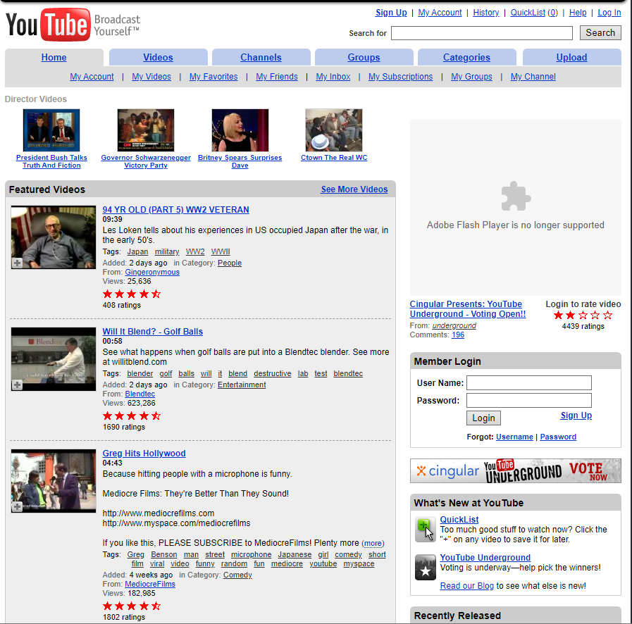

[Home](index.md) | [Manual Assessment Memo](manual_assessment_memo.md) | [Chatbot](chatbot.md) | [Procedure Video](procedure_video.md) | [Manual](manual.md) | [My Blog](reflective_blogs.md) 

# Table of Contents 
1. [Wayback Analysis](#wayback-analysis)
2. [Quick Start Guide](#quick-start-guide)
3. [Reflective Blog 3](#reflective-blog-3)
4. [Reflective Blog 4](#reflective-blog-4)
5. [Reflective Blog 5](#reflective-blog-5)
6. [Reflective Blog 6](#reflective-blog-6)
7. [Reflective Blog 7](#reflective-blog-7)

   
# Wayback Analysis

## YouTube, 2006

YouTube in 2006 was extremely cluttered. Listed at the top are the menu options, such as Home and Channels, similar to modern websites, however, the content underneath does not follow these modern standards.

Videos are lined up from top to bottom on the home page and displays the date added, description, and even the tags the video was uploaded under. Comparing this to modern YouTube, the details that YouTube includes in the browsing menu seem unnecessary to me and are not pleasing to the eye. There is too much information for a preview of a video.

To the right is the Member Login, which is strange to have as a sidebar on a website.
I also noticed that when you scroll, the menus at the top disappear, meaning you must scroll back up to navigate to another menu. 

In modern websites we expect previews of these videos and content to be simple and concise, and clicking reveals further information to the user. It is a standard that information that the typical user does not care about is hidden until clicked on. This creates a minimalist look for the site and is easy on the eyes. We also expect login pages to be their own separate page, not a sidebar on the home menu. It is very jarring because after years of websites following the same formula, seeing this type of formatting for a now very well known website is strange. 

Although this site would not pass in today's standards, visiting YouTube in 2006 felt like opening a time capsule. It is very cool to see a website that is now worth billions back when it was first starting out.

---
# Quick Start Guide
## Discord 
1. Click [this link](https://discord.com/download) to download Discord. Choose your download according to your device (Windows, Mac, Linux...).
2. Double click the DiscordSetup.exe file.
3. If you already have an account, log in with your information or QR code. If not, click Register and fill out the sign up fields and sign in.
<figure>

  <figcaption><em>Figure 1<em></figcaption>
</figure>

# Reflective Blog 3
TBD

# Reflective Blog 4
TBD

# Reflective Blog 5
TBD

# Reflective Blog 6
TBD

# Reflective Blog 7
TBD
